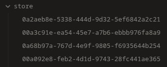

# Store

Manage your notes within a single folder. Almost.



## Usage

> [!WARNING]
> Though the plugin should be safe to the data, it's almost impossible to revert
> the changes to the vault's structure made by this plugin. You **should** make
> a backup of the vault before the first use.

It's recommended to read the documentation before installing the plugin. It's
hard to describe in a few words why this plugin is even needed and what it does,
so a separate usage "book" is needed. It's available in multiple languages.

See [docs](./docs).

## Installation

### Community plugins

This plugin is not available in Community plugins tab in Obsidian yet, because
the plugin isn't stable right now. When the plugin's 1.0.0 version releases, I
will submit a ticket.

### BRAT

You can install [BRAT](https://github.com/TfTHacker/obsidian42-brat) to
install/update the plugin automatically. Add the repository URL in "Beta plugin
list" section. It's recommended to not use the latest version right now, because
the plugin is not stable yet.

### GitHub releases

This repository has automatic GitHub releases, so you can manually install the
plugin in `vault/.obsidian/plugins/store` by copying `main.js` and
`manifest.json` there.

### Nix

This repository is a Nix flake and contains a package for the plugin. You can
either:

1. Use package for `obsidian` module in
   [home-manager](https://github.com/nix-community/home-manager/).
2. Manually install the package contents in `vault/.obsidian/plugins/store`.

## Contributing

All contributions with the suspicion of AI usage in text/code are immediately
declined.

### Nix

This repository is a Nix flake and contains a devshell, a formatter and some
checks.

```sh
nix develop
```

starts a shell with `pnpm` and `nodejs` available. To then format the project,
run

```sh
nix fmt
```

Before the pull request run

```sh
nix flake check
```

to ensure the package builds and the project is formatted.

### pnpm

On other setups you can just use `pnpm` directly. To format the project, run

```sh
pnpm fmt
```

to build the plugin, run

```sh
pnpm build
```
